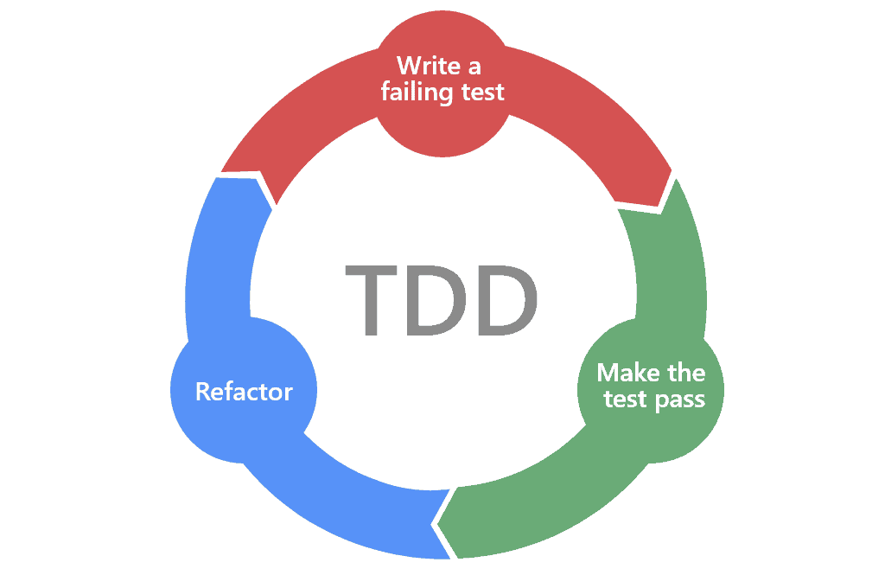
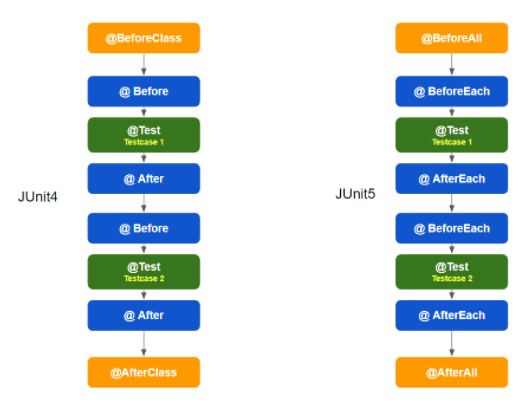

## TDD (Test-Driven-Development)
**테스트 주도개발**이라고 하며, 반복 테스트를 이용한 소프트웨어 방법론으로, 작은 단위의 테스트 케이스를 작성하고 이를 통과하는 코드를 추가하는 단계를 반복하여 구현한다.

### TDD 개발 주기

- { RED }단계에서는 실패하는 테스트 코드를 먼저 작성한다.
- { Green }단계에서는 테스트 코드를 성공시키기 위한 실제 코드를 작성한다.
- { Blue }단계에서는 중복 코드 제거, 일반화 등의 리팩토링을 수행한다.
 
중요한 것은 실패하는 테스트 코드를 작성할 때까지 실제 코드를 작성하지 않는 것과, 
실패하는 테스트를 통과할 정도의 최소 실제 코드를 작성해야하는 것이다. 
이를 통해 실제 코드에 대해 기대되는 바를 보다 명확하게 정의 함으로써 불필요한 설계를 피할 수 있고, 
정확한 요구 사항에 집중할 수 있다.

### 일반 개발방식

작은 부분의 기능 수정에도 **모든 부분을 테스트해야 하므로 전체적인 버그를 검출하기 어려워진다.**

### TDD 개발방식

테스트 코드를 작성한 뒤에 실제 코드를 작성한다. 이러한 반복적인 단계가 진행되면서 자연스럽게 코드의 버그가 줄어들고, 소스코드는 간결해진다.

### TDD 개발 방식의 장점
- 보다 튼튼한 객체 지향적인 코드 생상
- 재설계 시간의 단축
- 디버깅 시간의 단축
- 테스트 문서의 대체 가능
- 추가 구현의 용이함

### TDD 개발 방식의 단점
- **생산성의 저하**
  - 처음부터 2개의 코드를 짜야하고, 중간중간 테스트를 하면서 고쳐나가야 하기 때문에 일반 개발 방식에 비해 대략 10~30% 정도로 늘어난다.
  - SI프로젝트에서는 소프트웨어의 품질보다 납기일 준수가 중요하기 때문에 잘 사용하지 않는다.

### TDD를 하기 어려운 이유
- **이제까지 자신이 개발하던 방식을 많이 바꿔야 한다.**
  - 몸에 체득한 것이 많을 수록 바꾸기가 어렵다.
  - 오히려 개발을 별로 해보지 않은 사람들에겐 적용하기 쉽다.
- **TDD는 이렇게 해야된다는 이미지/틀이 있다.**
  - 반드시 툴(단위 테스트 프레임워크)을 써서 개발해야 된다고 생각한다.
  - 결국에는 규칙에 얽매여 똑같은 테스트를 Copy&Paste 한다.

## JUnit
### JUnit을 왜 사용하는가?
- 코드의 신뢰성을 높히고 빠르고 쉽게 구현
- 변경에 대한 과거 비즈니스로직 대한 검증

### 단위테스크 코드 5원칙( FIRST )
1. F - Fast : 테스트코드는 빠르게 실행되어야 한다.
2. I - Independent : 독립적으로 실행되어야 한다.
3. R - Repeatable : 반복 실행 가능해야 한다.
4. S - Self Validating : 메뉴얼 없이 테스트 코드만 성공해도 성공, 실패여부를 파악할 수 있어야 한다.
5. T - Timely : 즉시 사용 가능해야 한다.

### JUnit4, 5 실행 순서
- @Before(4), @BeforeEach(5) : 테스트 클래시의 각 테스트 메서드 실행 전 실행
- @After(4), @AfterEach(5) : 테스트 클래시의 각 테스트 메서드 실행 후 실행
- @BeforeClass(4), @BeforeAll(5) : 테스트 클래스의 모든 테스트 메서드가 실행 전에 실행
- @AfterClass(4), @AfterAll(5) : 테스트 클래스의 모든 테스트 메서드가 실행 후 실행
- @Test(4,5) : 클래스의 테스트 케이스
    

### @Runwith 어노테이션
JUnit 프레임워크 테스트 실행방법을 확장할 때 사용하는 어노테이션이다.
 ex. @Runwith(SpringRunner.class)는 스프링 부트와 JUnit 사이의 연결자 역할

### @WebMvcTest 어노테이션
스프링 부트의 컨트롤러를 JUnit으로 테스트하고 싶을 경우 Http Connection을 별도로 구현하지 않아도 MVC 테스트를 가능하게 할 수 있다.
- @WebMvcTest 자체의 기능은 컨트롤러가 예상대로 동작하는지 테스트하는 것이다. 다만, @Controller, @ControllerAdvise, @JsonComponent, Converter, GenericConverter, Filter, HandlerInterceptor, WebMvcConfigurer, HandlerMethodArgumentResolver 이 붙은 클래스만 스캔하도록 제한한다.

### MockMvc 객체란
- MockMvc는 웹 애플리케이션의 구동 없이 스프링 MVC의 동작을 재현할 수 있다.

1. perform()
   - DispatcherServlet에 요청
   - MockMvcRequestBuilder클래스를 사용해 설정한 요청 데이터를 perform()의 인수로 전달한다.
   - get, post, put, delete와 같은 메서드를 제공한다.
   - ResultActions 인터페이스를 반환한다.
2. 요청 데이터 설정
   - perform 메소드로 테스트 할 url을 설정했다면 이 url이 요청할 데이터 또한 설정할 수 있다.
   - MockHttpServletRequestBuilder 클래스가 이 기능을 제공한다.
   - **MockHttpServletRequestBuilder 주요 메서드**
     - param / params
       - 요청 파라미터 설정
     - header / headers
       - 요청 헤더 설정
       - contentTYpe & accept와 같은 특정 헤더를 설정하는 메서드도 제공
     - cookie
       - 쿠키 설정
     - content
       - 요청 본문 설정
     - requestAttr
       - 요청 스코프에 객체를 설정
     - flasgAttr
       - 플래시 스코프에 객체를 설정
     - sessionAttr
       - 세션 스코프에 객체를 설정
3. ResultActions 인터페이스
   - andDo()
     - log() : 실행결과를 디버깅 레벨에서 로그로 출력
     - print() : 실행결과를 임의의 출력대상에 출력, 출력대상을 지정하지 않으면 System.out 으로 출력한다.
   - andExpect()
     - 인수에 실행결과를 검증하는 MockMvcResultMatchers에서 제공하는 ResultMatcher을 지정한다.
     - **MockMvcResultMatcher 주요 메서드**
       - status
         - HTTP 상태 코드 검증
       - header
         - 응답 헤더의 상태 검증
       - cookie
         - 쿠키 상태 검증
       - content
         - 응답 본문 내용 검증 jsonPath나 xpath와 같은 특정 콘텐츠를 위한 메서드도 제공
       - view
         - 컨트롤러가 반환한 뷰 이름 검증
       - forwardedUrl
         - 이동대상의 경로를 검증, 패턴으로 검증할때는 forwardedUrlPattern 메서드를 사용
       - redirectedUrl
         - 리다이렉트 대상의 경로 또는 URL 검증 패턴으로 검증할때는 redirectedUrlPattern 메서드를 사용
       - model
         - 스프링 MVC 모델 상태 검증
       - flash
         - 플래시 스코프의 상태 검증
       - request
         - 서블릿 3.0부터 지원되는 비동기 처리의 상태나 요청 스코프의 상태, 세션 스코프의 상태 검증
   - andReturn()
     - return 결과를 반황할 때 쓰인다.

4. Given - When- Then 패턴(  준비 - 실행 - 검증 )
- 대표적인 테스트 방식으로 행위주도개발(Behavior-Driven-Development BDD)방식의 접근법
- Given
  - 테스트를 위해 준비를 하는 과정
  - 테스트에 사용되는 변수, 입력 값 등을 정의하거나 Mock 객체를 정의하는 구문도 Given에 포함
- When
  - 실제로 액션을 하는 테스트를 실행하는 과정
- Then
  - 테스트를 검증하는 과정
  - 주로 assertThat 메서드로 When에서 얻어낸 값과 비교한다.

5. AssertJ
- 단언문(assertion)을 작성하기 위한 인터페이스를 제공하는 자바 라이브러리
- 테스트 코드의 가독성을 향상시키고 테스트 유지관리를 더 쉽게 만드는 것이 목적
- spring-boot-starter-test에 기본적으로 포함
- 장점
  - 메서드 체이닝을 지원하여 깔끔하고 읽기 쉬운 테스트 코드 작성 가능
  - ※ junit의 assertThat은 ide에서 자동완성을 잘 지원안한다. 
- 단점
  - 라이브러리 의존성 설정
    - java 8 이상은 3.x 버전
    - java 7 이하는 2.x 버전

